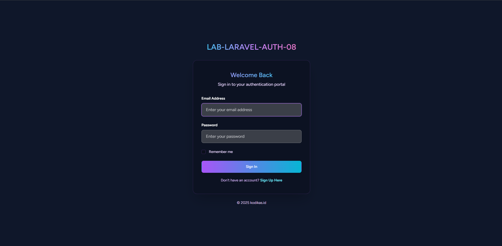
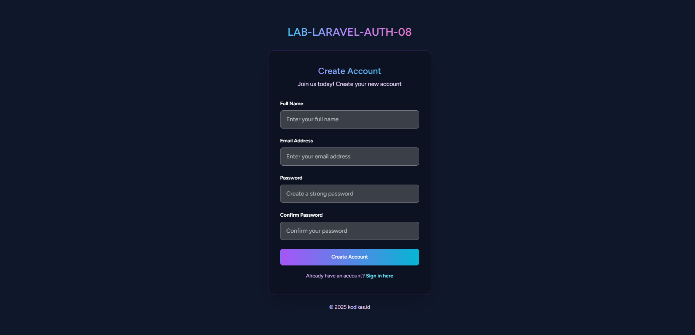
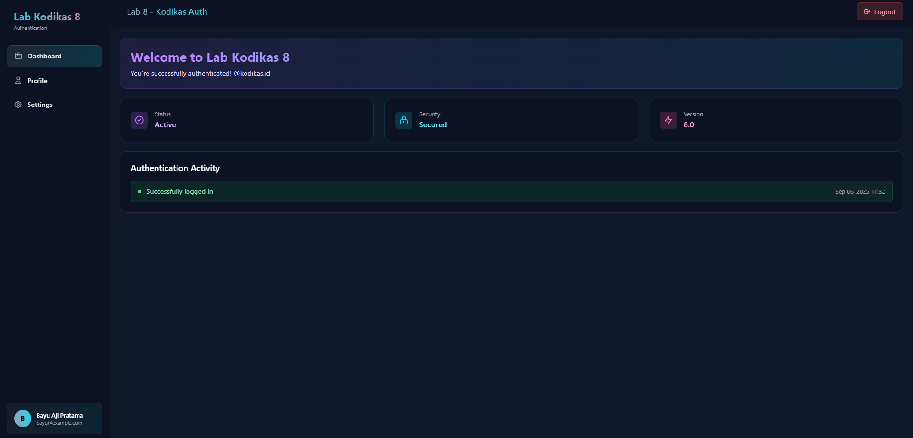

# LAB-Laravel-Auth
Implementasi Autentikasi Laravel 12 (Login, Register, Logout, Dashboard)

---

## Tugas
Proyek ini adalah aplikasi Laravel 12 sederhana dengan fitur autentikasi dasar.  
Sebelumnya aplikasi hanya memiliki halaman **Login**, **Register**, dan **Dashboard** tanpa proses autentikasi.  
Pada tugas ini kita harus menambahkan sistem autentikasi menggunakan Laravel:

1. **Membuat fitur Register**
   - User dapat mendaftar akun baru.  
   - Password disimpan dalam database dengan enkripsi menggunakan `bcrypt` (`Hash::make`).  
   - Validasi agar email unik (tidak boleh duplikat).  

2. **Membuat fitur Login**
   - User dapat login menggunakan email dan password.  
   - Validasi input login.  
   - Jika berhasil login → redirect ke halaman Dashboard.  
   - Jika gagal login → tampilkan pesan error.  

3. **Membuat fitur Logout**
   - User dapat keluar dari aplikasi.  
   - Session user dihapus setelah logout.  
   - Redirect kembali ke halaman login.  

4. **Mengambil data user yang sedang login**
   - Menampilkan data user dengan `Auth::user()`.  
   - Data user (contoh: nama dan email) ditampilkan di halaman Dashboard.  

---

## Fitur (MVP)
- Register user baru dengan validasi email.
- Password otomatis di-hash menggunakan `Hash::make()` atau `bcyrpt()`.  
- Login dengan email & password.  
- Logout menghapus session user.  
- Dashboard hanya bisa diakses oleh user yang sudah login (middleware `auth`).  
- Menampilkan data user yang sedang login.  

## Tampilan

### Halaman Login


### Halaman Register


### Halaman Dashboard


## Setup, Instalasi dan Pengumpulan

### Fork Repository
1. Buka link repository utama:  
   [https://github.com/kodikas-studio-id/lab-laravel-auth](https://github.com/kodikas-studio-id/lab-laravel-auth)  
2. Klik tombol **Fork** di pojok kanan atas.  
3. Pilih akun GitHub-mu → otomatis akan terbuat salinan repository di akunmu.  

### Setup
1. Clone repository:
```bash
git clone https://github.com/your-username/lab-laravel-auth.git
cd lab-laravel-auth
```

2. Install dependencies:
```bash
composer install
npm install && npm run dev
```

3. Copy file environment:
```bash
cp .env.example .env
```

4. Generate application key:
```bash
php artisan key:generate
```

5. Konfigurasi database di file `.env`:
```env
DB_DATABASE=kodikas_auth_lab
DB_USERNAME=root
DB_PASSWORD=
```

6. Migrasi database:
```bash
php artisan migrate
```

7. Jalankan server lokal:
```bash
php artisan serve
```

---

##  Sample User

* **Email:** `sample@kodikas.id`
* **Password:** `password`

Enjoy Coding! @kodikas.studio